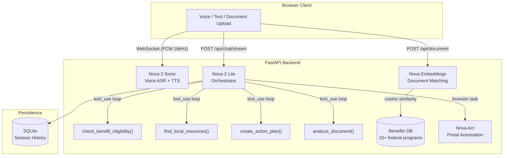

# Compass — AI Benefits Navigator


> **Every year, $30 billion in government benefits go unclaimed. Compass changes that.**

Compass is a voice-first AI that helps vulnerable populations — elderly adults, people with disabilities, immigrants, and low-income families — discover and apply for government benefits they're entitled to but don't know about.

---

## Architecture



---

## Features

| Feature | Description |
|---------|-------------|
| **Voice Interface** | Real-time bilingual conversation via Nova 2 Sonic (English, Spanish, French) |
| **Multi-Agent Loop** | Nova 2 Lite runs a full agentic loop — eligibility check → resources → action plan |
| **Document Analysis** | Upload a pay stub; Nova vision extracts income and auto-populates your profile |
| **Semantic Matching** | Nova Multimodal Embeddings matches document content to relevant programs |
| **Portal Automation** | Nova Act navigates benefits.gov and pre-fills application forms |
| **Session Persistence** | Conversations survive server restarts via SQLite (aiosqlite) |
| **Streaming Responses** | Server-Sent Events stream Nova Lite tokens as they generate |
| **Printable Report** | One-click benefits summary PDF for offline use |
| **Status Tracker** | Track application progress per-program in localStorage |

---

## Quick Start

### Local (Python)

```bash
git clone https://github.com/your-username/compass
cd compass

pip install -r requirements.txt
cp .env.example .env
# Edit .env — add AWS credentials and optional NOVA_ACT_API_KEY

python run.py
# Open http://localhost:8000
```

### Docker

```bash
docker build -t compass .
docker run -p 8000:8000 \
  -e AWS_ACCESS_KEY_ID=$AWS_ACCESS_KEY_ID \
  -e AWS_SECRET_ACCESS_KEY=$AWS_SECRET_ACCESS_KEY \
  -e AWS_DEFAULT_REGION=us-east-1 \
  compass
# Open http://localhost:8000
```

> Note: Docker image excludes Nova Act (saves ~500MB of Playwright browser binaries).
> Set `NOVA_ACT_ENABLED=true` with local installation to re-enable.

---

## Testing

```bash
pip install -r requirements.txt

# Unit tests — pure Python, no AWS needed (~30 cases)
pytest tests/test_eligibility.py -v

# All tests with coverage
pytest tests/ --cov=backend --cov-report=term-missing

# CI runs automatically on every push via GitHub Actions
```

Tests cover FPL threshold boundary conditions, Medicaid expansion state logic,
EITC phase-in/phase-out, SSI income limits, and Section 8 AMI cutoffs — all
without touching AWS.

---

## Deploy to Fly.io

Fly.io is the recommended target: WebSocket-compatible, free tier, single command.

```bash
# 1. Install Fly CLI
brew install flyctl

# 2. Login and create app (one-time)
fly auth login
fly launch --dockerfile Dockerfile --name compass-benefits --region iad --no-deploy

# 3. Set AWS credentials as secrets (never in code)
fly secrets set \
  AWS_ACCESS_KEY_ID="your-key-id" \
  AWS_SECRET_ACCESS_KEY="your-secret" \
  AWS_REGION="us-east-1"

# 4. Create a persistent volume for SQLite
fly volumes create compass_data --region iad --size 1

# 5. Deploy
fly deploy
# → https://compass-benefits.fly.dev
```

---

## Amazon Nova Integration

Compass uses all four Amazon Nova capabilities:

| Model | Usage |
|-------|-------|
| **Nova 2 Lite** | Multi-agent orchestrator — tool-use loop for eligibility, resources, document analysis, action plan |
| **Nova 2 Sonic** | Real-time bidirectional voice streaming — PCM 16kHz over WebSocket |
| **Nova Multimodal Embeddings** | Semantic document-to-program matching — cosine similarity over 1024-dim vectors |
| **Nova Act** | Browser automation — navigates government portals and pre-fills applications |

---

## API Reference

| Method | Endpoint | Description |
|--------|----------|-------------|
| `GET` | `/health` | Service health + model status |
| `POST` | `/api/chat` | Single-turn chat (blocking) |
| `POST` | `/api/chat/stream` | Streaming chat via SSE |
| `POST` | `/api/document` | Upload + analyze document |
| `GET` | `/api/session/{id}` | Retrieve full session state |
| `POST` | `/api/demo/{persona}` | Run a pre-built demo scenario |
| `POST` | `/api/navigate` | Trigger Nova Act portal navigation |
| `POST` | `/api/embedding/search` | Semantic search over programs |
| `GET` | `/api/programs` | List all benefit programs |
| `WS` | `/ws/voice/{id}` | WebSocket voice stream |

---

## Eligible Programs

SNAP · Medicaid · CHIP · TANF · WIC · LIHEAP · SSI · Section 8 · EITC · Medicare Savings Programs

---

## Project Structure

```
compass/
├── backend/
│   ├── agents/orchestrator.py    # Nova 2 Lite multi-agent loop
│   ├── database.py               # SQLite SessionStore (aiosqlite)
│   ├── main.py                   # FastAPI app + WebSocket
│   ├── config.py                 # 2024 FPL thresholds + Nova model IDs
│   ├── services/
│   │   ├── nova_lite.py          # Bedrock Converse API wrapper + streaming
│   │   ├── nova_sonic.py         # Bidirectional voice streaming
│   │   └── nova_embeddings.py    # Multimodal embeddings service
│   ├── tools/
│   │   ├── eligibility.py        # Pure eligibility logic (no I/O)
│   │   ├── resources.py          # Local resource finder
│   │   └── document_tool.py      # Document extraction tool
│   └── data/benefits_db.py       # 10+ federal programs knowledge base
├── frontend/
│   ├── index.html                # Single-page app (Tailwind CDN)
│   └── js/{app,api,voice}.js     # App controller + streaming client
├── tests/
│   ├── test_eligibility.py       # ~30 pure unit tests
│   └── test_api.py               # API tests with mocked AWS
├── Dockerfile                    # Multi-stage python:3.12-slim build
├── fly.toml                      # Fly.io config with SQLite volume
└── requirements.txt
```

---

## Social Impact

- **$30B** in benefits go unclaimed annually (NCOA)
- **7M** eligible people don't receive SNAP
- **60%** of eligible seniors never enroll in Medicare Savings Programs

Compass tears down these barriers through voice-first design, multilingual support,
and end-to-end automation that fills out forms so users don't have to.

---

## License

MIT — Built for the Amazon Nova Hackathon. **#AmazonNova**
